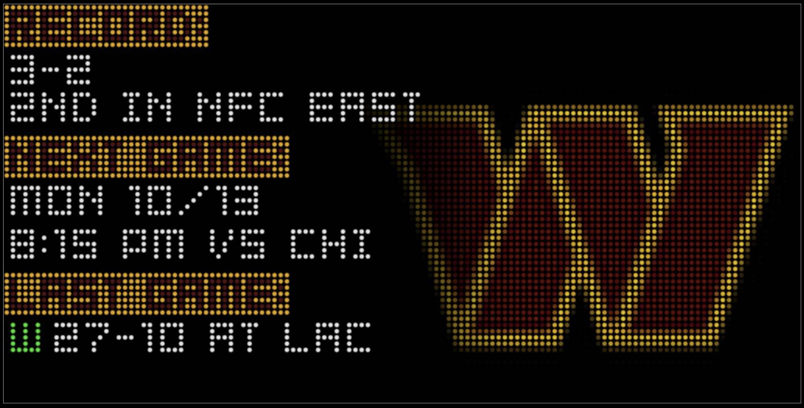
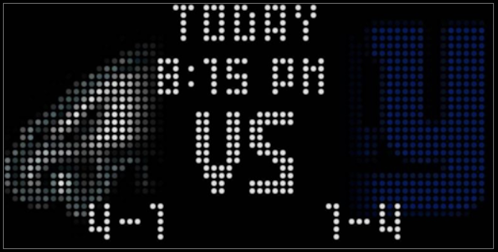
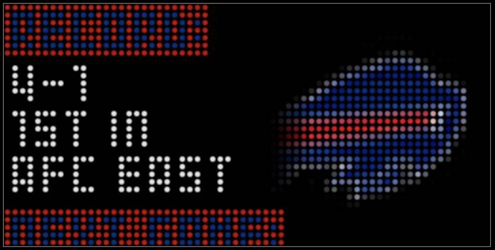
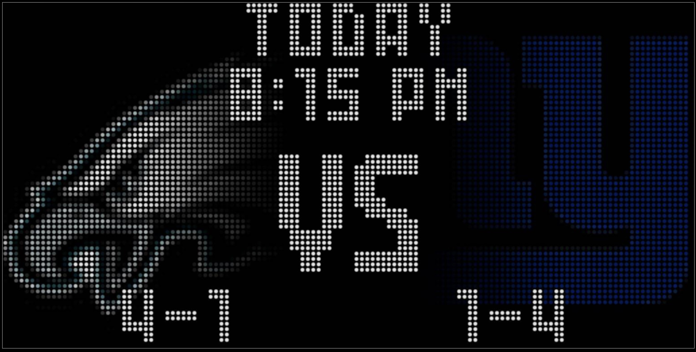
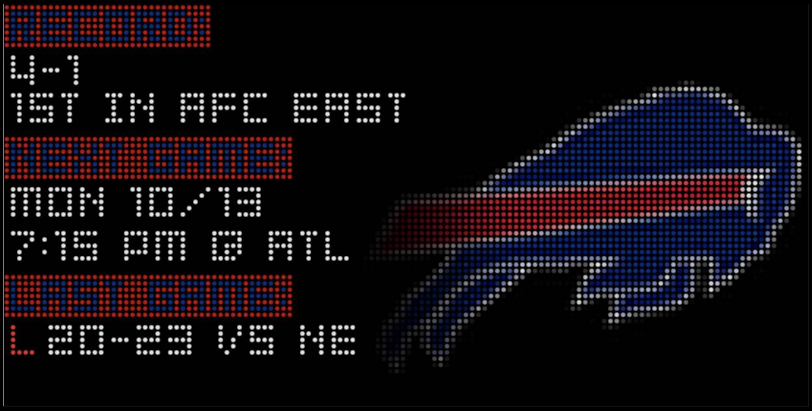

# NFL Board Plugin

A NFL scoreboard plugin for the [NHL LED Scoreboard](https://github.com/falkyre/nhl-led-scoreboard) that shows live games, scores, team information, and schedules for your favorite NFL teams.



## Table of Contents

- [Features](#features)
- [Installation](#installation)
- [Configuration](#configuration)
- [Display Modes](#display-modes)
- [Layouts](#layouts)
- [Logo Customization](#logo-customization)
- [Screenshots](#screenshots)

## Features

- **Live Game Display**: Real-time scores and game status for ongoing NFL games
- **Game Schedules**: Shows upcoming games with dates and times
- **Completed Games**: Displays final scores for finished games
- **Team Summaries**: Shows team records, next game, and last game results
- **Multi-Team Support**: Track multiple favorite teams simultaneously
- **Flexible Display Options**: Show only your favorite team's games or all NFL games happening today
- **Team Logos**: Automatic logo downloading and caching with customizable positioning
- **LED Matrix Sizes**: Supports both 64x32 and 128x64 matrix sizes

## Installation

Use the NHL Led Scoreboard's plugin manager python script to install:

`python plugins.py sync` if board is in your scoreboard's plugins.json

or

`python plugins.py add https://github.com/kas21/nls-plugin-nfl-board.git --ref latest`

After the plugin is installed, add `nfl_board` to your NHL-LED-Scoreboard's main configuration:

`nano config/config.json`

For example, to add it to the off day rotation:

```json
"states": {
    "off_day": [
        "season_countdown",
        "nfl_board",
        "team_summary",
        "scoreticker",
        "clock"
    ]
}
```

**Note:** You must restart the scoreboard for changes to take effect.

## Configuration

To customize the `nfl_board` settings, copy the sample config to create your own configuration file:

```bash
cd src/boards/plugins/nfl_board
cp config.json.sample config.json
nano config.json
```

**Note:** You must restart the scoreboard for changes to take effect.

### Example Configuration

```json
{
    "team_ids": ["28", "2"],
    "display_seconds": 5,
    "refresh_seconds": 180,
    "show_all_games": true,
    "show_previous_games_until": "09:00",
    "enabled": true
}
```

### Configuration Options

| Option | Type | Default | Description |
|--------|------|---------|-------------|
| `team_ids` | Array/String | Required | NFL team IDs to follow (see Team IDs section) |
| `display_seconds` | Integer | 8 | Seconds to display each screen |
| `refresh_seconds` | Integer | 300 | Seconds between data refreshes |
| `show_all_games` | Boolean | false | Show all NFL games, not just favorite teams |
| `show_previous_games_until` | String | "06:00" | Time (HH:MM) until which to show previous day's games |
| `enabled` | Boolean | true | Enable/disable the board (currently not functional) |

### Finding Team IDs

Team IDs correspond to ESPN's NFL team identifiers. Common team IDs include:

- **AFC East**: Buffalo Bills (2), Miami Dolphins (15), New England Patriots (17), New York Jets (20)
- **AFC North**: Baltimore Ravens (33), Cincinnati Bengals (4), Cleveland Browns (5), Pittsburgh Steelers (23)
- **AFC South**: Houston Texans (34), Indianapolis Colts (11), Jacksonville Jaguars (30), Tennessee Titans (10)
- **AFC West**: Denver Broncos (7), Kansas City Chiefs (12), Las Vegas Raiders (13), Los Angeles Chargers (24)
- **NFC East**: Dallas Cowboys (6), New York Giants (19), Philadelphia Eagles (21), Washington Commanders (28)
- **NFC North**: Chicago Bears (3), Detroit Lions (8), Green Bay Packers (9), Minnesota Vikings (16)
- **NFC South**: Atlanta Falcons (1), Carolina Panthers (29), New Orleans Saints (18), Tampa Bay Buccaneers (27)
- **NFC West**: Arizona Cardinals (22), Los Angeles Rams (14), San Francisco 49ers (25), Seattle Seahawks (26)

## Display Modes

The board intelligently displays different content based on game status:

### Live Games

- Team logos and abbreviations
- Current score
- Quarter and time remaining

### Upcoming Games

- Team logos and abbreviations
- Team records
- Game date and time
- "VS" indicator

### Completed Games

- Team logos and abbreviations
- Final score
- "FINAL" status

### Team Summary (when no games scheduled)

- Team logo
- Team name with team colors
- Season record
- Next scheduled game
- Last game result

## Layouts

The plugin includes pre-configured layouts for different matrix sizes:

- `layout_64x32.json` - For 64x32 pixel displays
- `layout_128x64.json` - For 128x64 pixel displays

Layouts define the positioning of:

- Team logos
- Team names
- Scores/records
- Game status
- Date/time information

## Logo Customization

Team logo positioning and sizing can be customized in `logo_offsets.json`. The plugin supports element-specific offsets to handle different display contexts (team summary, home team in game, away team in game).

### Configuration Structure

```json
{
    "_default": {
        "zoom": 1.0,
        "offset": [0, 0]
    },
    "WSH": {
        "team_logo": {
            "zoom": 1.1,
            "offset": [-4, 0]
        },
        "home_team_logo": {
            "zoom": 1.4,
            "offset": [0, 7]
        },
        "away_team_logo": {
            "zoom": 1.4,
            "offset": [0, 0]
        }
    }
}
```

### Offset Keys

- **`_default`**: Global fallback settings applied to all teams/elements unless overridden
- **`team_logo`**: Used when displaying team summaries (when no games are scheduled)
- **`home_team_logo`**: Used when the team is the home team in a game display
- **`away_team_logo`**: Used when the team is the away team in a game display

### Parameters

- **`zoom`**: Scale factor for the logo (1.0 = original size, 1.2 = 20% larger, 0.8 = 20% smaller)
- **`offset`**: `[x, y]` pixel offset for fine-tuning logo position

Logos are automatically downloaded from ESPN and cached in the `assets/logos/nfl/` directory.

## Screenshots

### 64x32 Display

#### Upcoming/Live/Completed Game



#### Team Summary



### 128x64 Display

#### Game Display



#### Team Summary - Washington Commanders


#### Team Summary - Buffalo Bills


