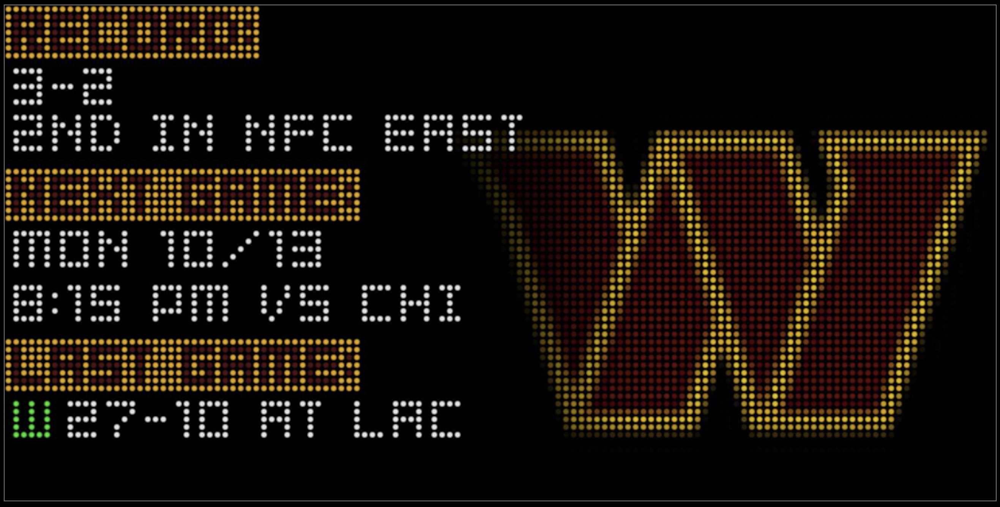
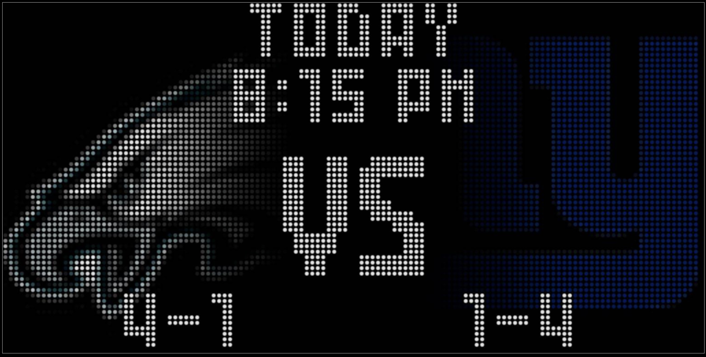
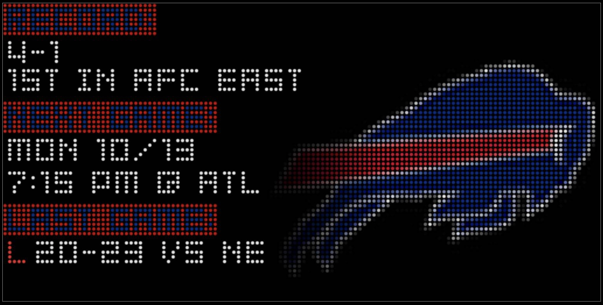
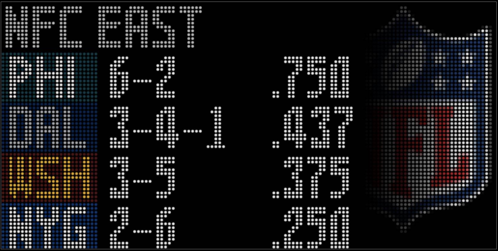
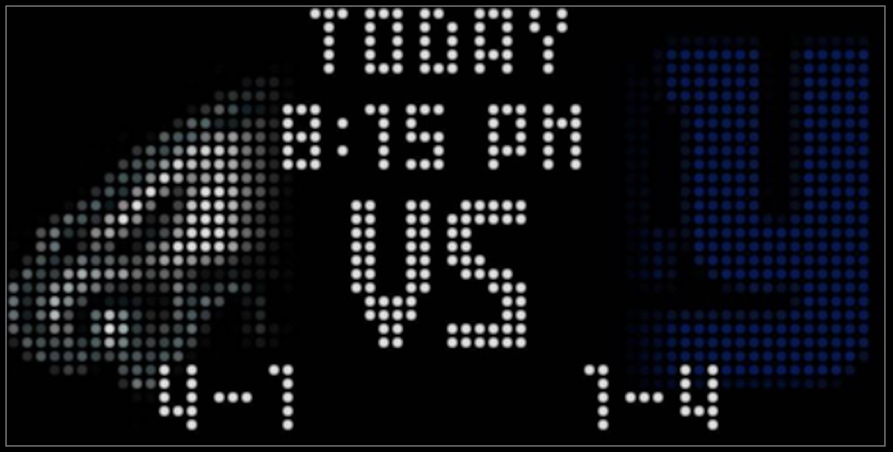
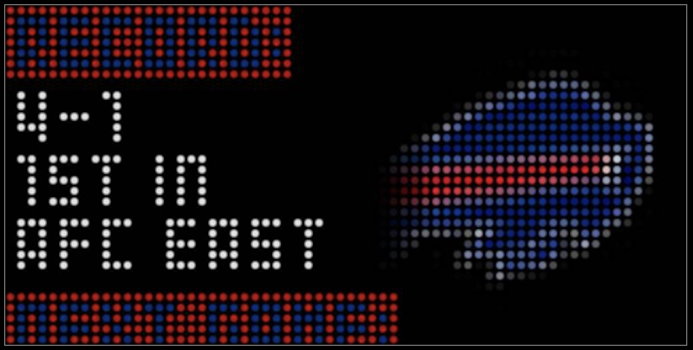
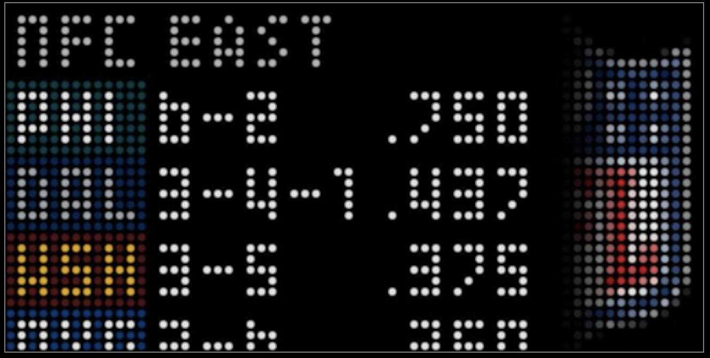

# NFL Board Plugin

A NFL scoreboard plugin for the [NHL LED Scoreboard](https://github.com/falkyre/nhl-led-scoreboard) that shows live games, scores, team information, schedules, and standings for your favorite NFL teams.



<a href="https://www.buymeacoffee.com/kas21" target="_blank"></a>

## Table of Contents

- [Features](#features)
- [Installation](#installation)
- [Configuration](#configuration)
- [Display Modes](#display-modes)
- [Layouts](#layouts)
- [Logo Customization](#logo-customization)
- [Caching System](#caching-system)
- [Screenshots](#screenshots)

## Features

- **Live Game Display**: Real-time scores and game status for ongoing NFL games
- **Game Schedules**: Shows upcoming games with dates and times
- **Completed Games**: Displays final scores for finished games
- **Team Summaries**: Shows team records, next game, and last game results
- **Standings Board**: Display current NFL standings by division or conference with team-colored backgrounds
- **Multi-Team Support**: Track multiple favorite teams simultaneously
- **Flexible Display Options**: Show only your favorite team's games or all NFL games happening today
- **Team Logos**: Automatic logo downloading and caching with customizable positioning
- **LED Matrix Sizes**: Supports both 64x32 and 128x64 matrix sizes
- **Smart Caching**: Stale-while-revalidate caching for improved performance and resilience

## Installation

Use the NHL Led Scoreboard's plugin manager python script to install or upgrade:

`python plugins.py sync` if board is in your scoreboard's plugins.json.  This will install or upgrade the plugin.

or

`python plugins.py add https://github.com/kas21/nls-plugin-nfl-board.git`

After the plugin is installed, add `nfl_board` and/or `nfl_standings` to your NHL-LED-Scoreboard's main configuration:

`nano config/config.json`

For example, to add both boards to the off day rotation:

```json
"states": {
    "off_day": [
        "season_countdown",
        "nfl_board",
        "nfl_standings",
        "team_summary",
        "scoreticker",
        "clock"
    ]
}
```

**Important:** The `nfl_standings` board **requires** the `nfl_board` to be enabled. The main NFL board handles all data loading, caching, and scheduled refreshes. The standings board reads from the shared data snapshot created by the main board. You cannot use `nfl_standings` alone.

**Note:** You must restart the scoreboard for changes to take effect.

## Configuration

To customize the plugin settings, copy the sample config to create your own configuration file:

```bash
cd src/boards/plugins/nfl_board
cp config.sample.json config.json
nano config.json
```

**Note:** You must restart the scoreboard for changes to take effect.

### Example Configuration

```json
{
    "team_ids": ["28", "2"],
    "display_seconds": 5,
    "refresh_seconds": 180,
    "show_all_games": true,
    "show_previous_games_until": "09:00",
    "enabled": true,
    "division": "NFC East",
    "display_type": "division",
    "scroll_speed": 0.2,
    "use_large_font": true,
    "disable_win_pct": false
}
```

### NFL Board Configuration Options

| Option | Type | Default | Description |
|--------|------|---------|-------------|
| `team_ids` | Array/String | Required | NFL team IDs to follow (see Team IDs section) |
| `display_seconds` | Integer | 8 | Seconds to display each screen |
| `refresh_seconds` | Integer | 300 | Seconds between data refreshes |
| `show_all_games` | Boolean | false | Show all NFL games, not just favorite teams |
| `show_previous_games_until` | String | "06:00" | Time (HH:MM) until which to show previous day's games |
| `enabled` | Boolean | true | Enable/disable the board (currently not functional) |

**Note:** Cache expiration times are set based on data type:

- **Team data** (logos, colors, names): 24 hours - rarely changes
- **Schedules**: 12 hours - rarely changes but just in case
- **Standings/Records**: 4 hours - updates after games
- **Scoreboard data** (dynamic based on game state):
  - Live games: 1 minute - needs frequent updates
  - Games starting within 2 hours: 1 minute - catch when they go live
  - All games completed: 12 hours - final scores don't change
  - All games far in future: 1 hour - game times stable

### NFL Standings Board Configuration Options

**Dependency:** This board requires `nfl_board` to be enabled. It reads data from the shared snapshot created by the main NFL board.

| Option | Type | Default | Description |
|--------|------|---------|-------------|
| `division` | String or Array | "NFC East" | Division/conference name(s) to display. Can be a single string or array for multiple divisions |
| `display_type` | String | "division" | Display mode: "division" or "conference" |
| `scroll_speed` | Float | 0.2 | Speed of scrolling for long standings lists (pixels per frame) |
| `use_large_font` | Boolean | true | Use larger font for standings (recommended for 128x64 displays) |
| `disable_win_pct` | Boolean | false | Disable displaying win percentage, showing only team records |

#### Division Configuration Examples

**Single Division (backwards compatible):**
```json
{
    "division": "NFC East",
    "display_type": "division"
}
```

**Multiple Divisions (rotates through each):**
```json
{
    "division": ["AFC East", "NFC East", "AFC North"],
    "display_type": "division"
}
```

**Multiple Conferences:**
```json
{
    "division": ["AFC", "NFC"],
    "display_type": "conference"
}
```

**Important Configuration Notes:**

When `display_type` is set to `"conference"`:
- Use conference names directly: `["AFC", "NFC"]`
- Or use division names and the conference will be auto-extracted: `["AFC East", "NFC North"]` → shows AFC and NFC conferences
- The board will automatically extract the conference from division names (e.g., "AFC East" → "AFC")

When `display_type` is set to `"division"`:
- Use full division names: `"AFC East"`, `"NFC North"`, `"AFC West"`, etc.
- **Shortcut:** Use `"AFC"` or `"NFC"` to show ALL divisions in that conference
  - `"AFC"` expands to: `["AFC East", "AFC North", "AFC South", "AFC West"]`
  - `"NFC"` expands to: `["NFC East", "NFC North", "NFC South", "NFC West"]`

**Examples with shortcuts:**

```json
{
    "division": "NFC",
    "display_type": "division"
}
```
This will rotate through all 4 NFC divisions (NFC East → NFC North → NFC South → NFC West), showing each division's standings separately.

```json
{
    "division": ["AFC", "NFC East"],
    "display_type": "division"
}
```
This will show all 4 AFC divisions, then NFC East (5 total division standings).

Valid division names:
- **AFC**: `"AFC East"`, `"AFC North"`, `"AFC South"`, `"AFC West"`
- **NFC**: `"NFC East"`, `"NFC North"`, `"NFC South"`, `"NFC West"`

When multiple divisions/conferences are configured, the board will cycle through each one, displaying each for the configured `display_seconds` duration.

### Finding Team IDs

Team IDs correspond to ESPN's NFL team identifiers. Common team IDs include:

- **AFC East**: Buffalo Bills (2), Miami Dolphins (15), New England Patriots (17), New York Jets (20)
- **AFC North**: Baltimore Ravens (33), Cincinnati Bengals (4), Cleveland Browns (5), Pittsburgh Steelers (23)
- **AFC South**: Houston Texans (34), Indianapolis Colts (11), Jacksonville Jaguars (30), Tennessee Titans (10)
- **AFC West**: Denver Broncos (7), Kansas City Chiefs (12), Las Vegas Raiders (13), Los Angeles Chargers (24)
- **NFC East**: Dallas Cowboys (6), New York Giants (19), Philadelphia Eagles (21), Washington Commanders (28)
- **NFC North**: Chicago Bears (3), Detroit Lions (8), Green Bay Packers (9), Minnesota Vikings (16)
- **NFC South**: Atlanta Falcons (1), Carolina Panthers (29), New Orleans Saints (18), Tampa Bay Buccaneers (27)
- **NFC West**: Arizona Cardinals (22), Los Angeles Rams (14), San Francisco 49ers (25), Seattle Seahawks (26)

## Display Modes

The board intelligently displays different content based on game status:

### Live/Upcoming/Completed Games

- Team logos VS'
- Quarter and time remaining or Game date and time
- Score or Team Record

### Team Summary (when no games scheduled)

- Team logo
- Team name with team colors
- Season record
- Next scheduled game
- Last game result

### NFL Standings Board

The standings board displays current NFL standings with the following features:

- **Division View**: Shows all teams in a specific division (e.g., "NFC East", "AFC North")
- **Conference View**: Shows all teams in a conference (e.g., "NFC", "AFC")
- **Team-Colored Backgrounds**: Each team entry uses the team's primary color as background
- **Smart Text Colors**: Team abbreviations use secondary team colors with WCAG-compliant contrast checking
- **Win Percentage**: Displays win percentage alongside team records (can be disabled with `disable_win_pct` option)
- **Automatic Scrolling**: Scrolls smoothly when standings exceed display height

Standings are sorted by wins (descending), losses (ascending), and ties.

**Note:** This board requires the main `nfl_board` to be enabled, as it depends on the shared data snapshot for team information and records.

## Layouts

The plugin includes pre-configured layouts for different matrix sizes:

- `layout_64x32.json` - For 64x32 pixel displays
- `layout_128x64.json` - For 128x64 pixel displays

Layouts define the positioning of:

- Team logos
- Team names
- Scores/records
- Game status
- Date/time information

## Logo Customization

Team logo positioning and sizing can be customized in `logo_offsets.json`. The plugin supports element-specific offsets to handle different display contexts (team summary, home team in game, away team in game).

### Configuration Structure

```json
{
    "_default": {
        "zoom": 1.0,
        "offset": [0, 0]
    },
    "WSH": {
        "team_logo": {
            "zoom": 1.1,
            "offset": [-4, 0]
        },
        "home_team_logo": {
            "zoom": 1.4,
            "offset": [0, 7]
        },
        "away_team_logo": {
            "zoom": 1.4,
            "offset": [0, 0]
        }
    }
}
```

### Offset Keys

- **`_default`**: Global fallback settings applied to all teams/elements unless overridden
- **`team_logo`**: Used when displaying team summaries (when no games are scheduled)
- **`home_team_logo`**: Used when the team is the home team in a game display
- **`away_team_logo`**: Used when the team is the away team in a game display

### Parameters

- **`zoom`**: Scale factor for the logo (1.0 = original size, 1.2 = 20% larger, 0.8 = 20% smaller)
- **`offset`**: `[x, y]` pixel offset for fine-tuning logo position

Logos are automatically downloaded from ESPN and cached in the `assets/logos/nfl/` directory.

## Caching System

The NFL Board uses an intelligent multi-tier caching system for optimal performance and data freshness.

### Cache Benefits

- **Fast Startup**: Loads from cache in < 1 second (vs 5-10 seconds from API)
- **Resilient**: Serves stale data if API is unavailable
- **Efficient**: Reduces API calls by 90%+ during normal operation
- **Smart Expiration**: Different data types have appropriate cache lifetimes

### Cache Structure

The board caches data in `/tmp/sb_cache/` with intelligent expiration times:

| Cache Key | Data | Expiration | Rationale |
|-----------|------|------------|-----------|
| `nfl_all_teams` | Basic team info (32 teams) | 24 hours | Rarely changes |
| `nfl_team_details_{id}` | Team records/standings | 4 hours | Updates after games |
| `nfl_scoreboard_{date}` | Games for specific date | Dynamic | See below |
| `nfl_schedule_{id}` | Team schedule | 12 hours | Changes weekly |

### Dynamic Scoreboard Caching

Scoreboard cache expires based on game state:

- **Live games**: 1 minute (frequent score updates)
- **Games starting within 2 hours**: 1 minute (catch when they go live)
- **All games completed**: 12 hours (final scores stable)
- **All games far in future**: 1 hour (times stable)

### Cache Utilities

**Inspect cache contents:**

```bash
uv run scripts/check_cache.py
```

**Clear cache:**

```bash
rm -rf /tmp/sb_cache
```

**Detailed documentation:** See [docs/CACHING.md](docs/CACHING.md) for complete cache architecture, data structures, and troubleshooting.

## Screenshots

### 128x64 Display

#### Game Display



#### Team Summary - Washington Commanders


#### Team Summary - Buffalo Bills



#### Standings - NFC East



### 64x32 Display

#### Upcoming/Live/Completed Game



#### Team Summary



#### Standings


